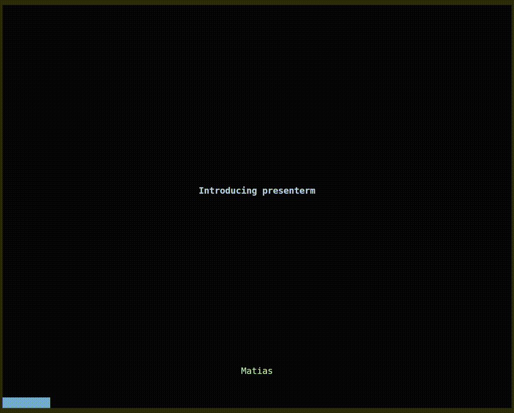
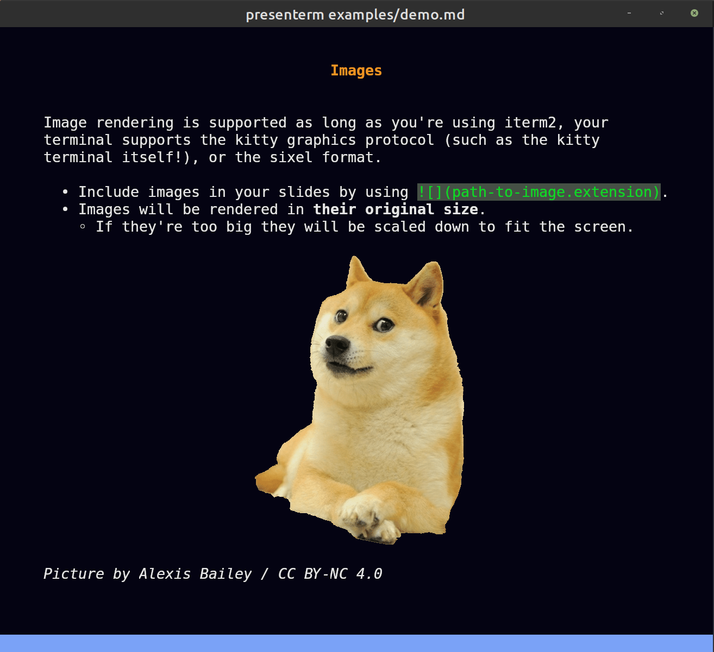

presenterm
---

A terminal based slideshow tool.

---

_presenterm_ lets you define slideshows that run in your terminal.

This tool is heavily inspired by [slides](https://github.com/maaslalani/slides/) and 
[lookatme](https://github.com/d0c-s4vage/lookatme).

The following is a presentation of the [demo presentation](examples/demo.md):



# Installation

In order to install, download [rust](https://www.rust-lang.org/) and run:

```shell
cargo install presenterm
```

## Latest unreleased version

To run the latest unreleased version clone the repo, then run:

```shell
cargo build --release
```

The output binary will be in `./target/release/presenterm`.

# Features

* Define your presentation in a single markdown file.
* Image rendering support for iterm2, terminals that support the kitty graphics protocol, or sixel.
* Customize your presentation's look by defining themes, including colors, margins, layout (left/center aligned 
  content), footer for every slide, etc.
* Code highlighting for a wide list of programming languages.
* Support for an introduction slide that displays the presentation title and your name.
* Support for slide titles.
* Create pauses in between each slide so that it progressively renders for a more interactive presentation.
* Text formatting support for **bold**, _italics_, ~strikethrough~, and `inline code`.
* Automatically reload your presentation every time it changes for a fast development loop.

## Hot reload

Unless you run in presentation mode by passing in the `--present` parameter, _presenterm_ will automatically reload your 
presentation file every time you save it. _presenterm_ will also automatically detect which specific slide was modified 
and jump to it so you don't have to be jumping back and forth between the source markdown and the presentation to see 
how the changes look like.

[](https://asciinema.org/a/krCrToJtoPM0grhvAr5dLWe4U)

## Slides

Every slide must be separated by an HTML comment:

```html
<!-- end_slide -->
```

This makes it explicit that you want to end the current slide. Other tools use `---` instead which is less explicit and 
also is a valid markdown element which you may use in your presentation.

## Pauses

Just like [lookatme](https://github.com/d0c-s4vage/lookatme) does, _presenterm_ allows pauses in between your slide. 
This lets you have more interactive presentations where pieces of it start popping up as you move forward through it.

Similar to slide delimiters, pauses can be created by using the following HTML comment:

```html
<!-- pause -->
```

## Images

Images are supported if you're using iterm2, a terminal the supports the kitty graphics protocol (such as 
[kitty](https://sw.kovidgoyal.net/kitty/), of course), or one that supports sixel. This last one requires building 
_presenterm_ with the `sixel` feature flag, which is disabled by default.

Images are rendered **in their default size**. This means if your terminal window is 100 pixels wide and your image is 
50 pixels wide, it will take up 50% of the width. If an image does not fit in the screen, it will be scaled down to fit 
it.



## Themes

_presenterm_ supports themes so you can customize your presentation's look. See the [built-in themes](themes) as 
examples on how to customize them.

You can define your own themes and make your presentation use it or you can also customize a theme within your 
presentation by including a front matter at the beginning of your presentation file:

```yaml
---
theme:
  # Specify it by name for built-in themes
  name: my-favorite-theme

  # Otherwise specify the path for it
  path: /home/myself/themes/epic.yaml

  # Or override parts of the theme right here
  override:
    default:
      colors:
        foreground: white
---
```

Note that if you're in the default hot reload mode, overriding your theme will result in those changes being immediately 
applied to your presentation. This lets you easily test out color schemes quickly without having to close and reopen the 
application.

## Introduction slide

By including a `title`, `sub_title` and/or `author` attribute in your front matter, you can create an introduction slide 
at the beginning of your presentation to display those:

```yaml
---
title: My first presentation
sub_title: (in presenterm!)
author: John Doe
---
```

## Slide titles

By using [setext headers](https://spec.commonmark.org/0.20/#setext-headers) you can create slide titles. These allow you 
to have a more slide-title-looking slide titles than using regular markdown headers:

```markdown
My slide title
---
```

> Note: nothing prevents you from using setext headers somewhere in the middle of a slide, which will make them render 
> as slide titles. Not sure why you'd want that but hey, you're free to do so!

## Navigation

Navigation should be intuitive: jumping to the next/previous slide can be done by using the arrow, hjkl, and page 
up/down keys.

Besides this:

* Jumping to the first slide: `gg`.
* Jumping to the last slide: `G`.
* Jumping to a specific slide: `<slide-number>G`.
* Exit the presentation: `<ctrl>c`.

# Docs

Some docs on how to configure _presenterm_ and how it works internally can be found [here](docs/README.md).
