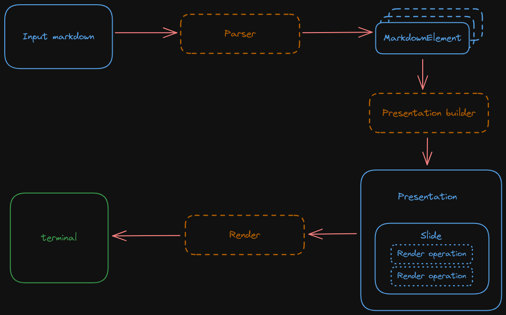

# Parsing and rendering

This document goes through the internals of how we take a markdown file and finish rendering it into the terminal 
screen.

## Parsing

Markdown file parsing is done via the [comrak](https://github.com/kivikakk/comrak) crate. This crate parses the markdown 
file and gives you back an AST that contains the contents and structure of the input file.

ASTs are a logical way of representing the markdown file but this structure makes it a bit hard to process. Given our 
ultimate goal is to render this input, we want it to be represented in a way that facilitates that. Because of this we 
first do a pass on this AST and construct a list of `MarkdownElement`s. This enum represents each of the markdown 
elements in a flattened, non-recursive, way:

* Inline text is flattened so that instead of having a recursive structure you have chunks of text, each with their own 
  style. So for example the text "**hello _my name is ~bob~_**" which would look like a 3 level tree (I think?) in the 
  AST, gets transformed to something like `[Bold(hello), ItalicsBold(my name is), ItalicsBoldStrikethrough(bob)]` (names 
  are completely not what they are in the code, this is just to illustrate flattening). This makes it much easier to 
  render text because we don't need to walk the tree and keep the state between levels.
* Lists are flattened into a single `MarkdownElement::List` element that contains a list of items that contain their 
  text, prefix ("\*" for bullet lists), and nesting depth. This also simplifies processing as list elements can also 
  contain formatted text so we would otherwise have the same problem as above.

This first step then produces a list of elements that can easily be processed.

## Building the presentation

The format above is _nicer_ than an AST but it's still not great to be used as the input to the code that renders the 
presentation for various reasons:

* The presentation needs to be styled, which means we need to apply a theme on top of it to transform it. Putting this 
  responsibility in the render code creates too much coupling: now the render needs to understand markdown _and_ how 
  themes work.
* The render code tends to be a bit annoying: we need to jump around in the screen, print text, change colors, etc. If 
  we add the responsibility of transforming the markdown into visible text to the render code itself, we end up having a 
  mess of UI code mixed with the markdown element processing.
* Some elements can't be printed as-is. For example, a list item has text and a prefix, so we don't want the render code 
  to be in charge of understanding and executing those transformations.

Because of this, we introduce a step in between parsing and rendering where we build a presentation. A presentation is 
made up of a list of slides and each slide is made up of render operations. Render operations are the primitives that 
the render code understands to print text on the screen. These can be the following, among others:

* Render text.
* Clear the screen.
* Set the default colors to be used.
* Render a line break.
* Jump to the middle of the screen.

This allows us to have a simple model where the logic that takes markdown elements and a theme and chooses _how_ it will 
be rendered is in one place, and the logic that takes those instructions and executes them is elsewhere. So for example, 
this step will take a bullet point and concatenate is suffix ("\*" for bullet points for example), turn that into a 
single string and generate a "render text" operation.

This has the nice added bonus that the rendering code doesn't have to be fiddling around with string concatenation or 
other operations that could take up CPU cycles: it just takes these render operations and executes them. Not that 
performance matters here but it's nice to get better performance for free.

## Render a slide

The rendering code is straightforward and simply takes the current slide, iterates all of its rendering operations, and 
executes those one by one. This is done via the [crossterm](https://github.com/crossterm-rs/crossterm) crate. 

The only really complicated part is fitting text into the screen. Because we apply our own margins, we perform word 
splitting and wrapping around manually, so there's some logic that takes the text to be printed and the width of the 
terminal and splits it accordingly.

Note that this piece of code is the only one aware of the current screen size. This lets us forget in previous steps 
about how large the screen is and simply delegate that responsibility to this piece.

## Entire flow

